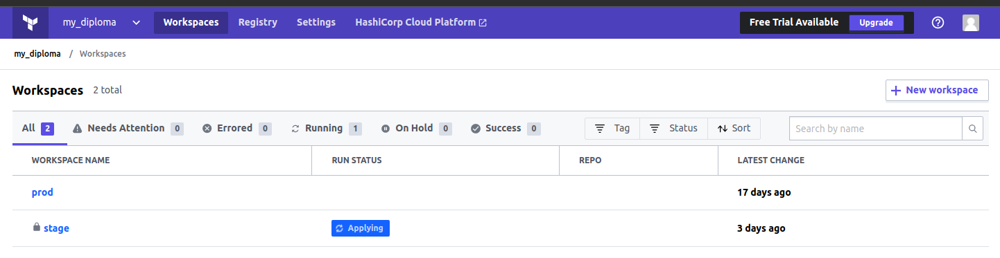
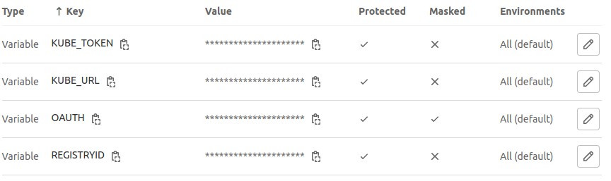
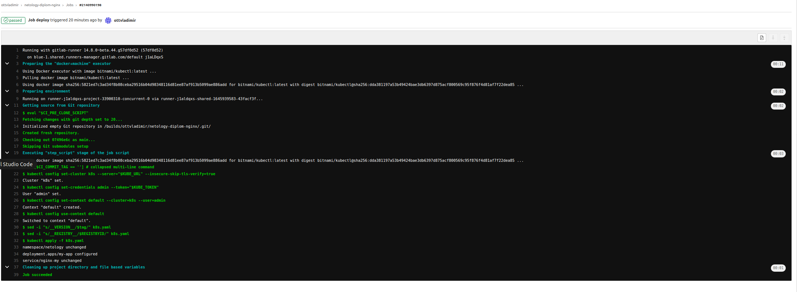

# Дипломный практикум в Яндекс.Облако
  * [Цели:](#цели)
  * [Этапы выполнения:](#этапы-выполнения)
     * [Создание облачной инфраструктуры](#создание-облачной-инфраструктуры)
     * [Создание Kubernetes кластера](#создание-kubernetes-кластера)
     * [Создание тестового приложения](#создание-тестового-приложения)
     * [Подготовка cистемы мониторинга и деплой приложения](#подготовка-cистемы-мониторинга-и-деплой-приложения)
     * [Установка и настройка CI/CD](#установка-и-настройка-cicd)
  * [Что необходимо для сдачи задания?](#что-необходимо-для-сдачи-задания)
  * [Как правильно задавать вопросы дипломному руководителю?](#как-правильно-задавать-вопросы-дипломному-руководителю)

---
## Цели:

1. Подготовить облачную инфраструктуру на базе облачного провайдера Яндекс.Облако.
2. Запустить и сконфигурировать Kubernetes кластер.
3. Установить и настроить систему мониторинга.
4. Настроить и автоматизировать сборку тестового приложения с использованием Docker-контейнеров.
5. Настроить CI для автоматической сборки и тестирования.
6. Настроить CD для автоматического развёртывания приложения.

---
## Этапы выполнения:


### Создание облачной инфраструктуры

Подготавливаю облачную инфраструктуру в ЯО при помощи terraform.

Предварительная подготовка к установке и запуску Kubernetes кластера.

1. Создайте сервисный аккаунт, который будет в дальнейшем использоваться Terraform для работы с инфраструктурой с необходимыми и достаточными правами. Не стоит использовать права суперпользователя
```bash
yc iam service-account create terraform
yc iam key create --service-account-name terraform -o terraform.json
yc config set service-account-key terraform.json
export TF_VAR_yc_token=$(yc iam create-token)
SERVICE_ACCOUNT_ID=$(yc iam service-account get --name terraform --format json | jq -r .id)
FOLDER_ID=$(yc iam service-account get --name terraform --format json | jq -r .folder_id)
yc resource-manager folder add-access-binding $FOLDER_ID --role editor --subject 
yc iam service-account add-access-binding $SERVICE_ACCOUNT_ID --role editor 
serviceAccount:$SERVICE_ACCOUNT_ID
```
2. Подготавливаю backend на Terraform Cloud 
#### backend.tf
```tf
# backend.tf
terraform {
  backend "remote" {
    organization = "my_diploma"
    workspaces {
      prefix = "netology-diploma-"
    }
```
```bash
$ cat ~/.terraformrc
credentials "app.terraform.io" {
token = "Place your token here"
}
```
3. Настраиваю workspaces  
```bash
$ terraform workspace new stage && terraform workspace new prod
Created and switched to workspace "stage"!

You're now on a new, empty workspace. Workspaces isolate their state,
so if you run "terraform plan" Terraform will not see any existing state
for this configuration.
Created and switched to workspace "prod"!

You're now on a new, empty workspace. Workspaces isolate their state,
so if you run "terraform plan" Terraform will not see any existing state
for this configuration.
$ terraform workspace select stage
Switched to workspace "stage".
```
4. Создаю VPC с подсетями в разных зонах доступности.
#### networks.tf
```tf
# networks.tf
# Create ya.cloud VPC
resource "yandex_vpc_network" "k8s-network" {
  name = "ya-network"
}
# Create ya.cloud public subnet
resource "yandex_vpc_subnet" "k8s-network-a" {
  name           = "public-a"
  zone           = "ru-central1-a"
  network_id     = yandex_vpc_network.k8s-network.id
  v4_cidr_blocks = ["172.28.0.0/24"]
}
resource "yandex_vpc_subnet" "k8s-network-b" {
  name           = "public-b"
  zone           = "ru-central1-b"
  network_id     = yandex_vpc_network.k8s-network.id
  v4_cidr_blocks = ["172.28.10.0/24"]
}
resource "yandex_vpc_subnet" "k8s-network-c" {
  name           = "public-c"
  zone           = "ru-central1-c"
  network_id     = yandex_vpc_network.k8s-network.id
  v4_cidr_blocks = ["172.28.20.0/24"]
}
```
6. Проверяю команды `terraform destroy` и `terraform apply` без дополнительных ручных действий.
```bash
$ terraform apply
Terraform used the selected providers to generate the following execution plan. Resource actions are indicated with the following symbols:
  + create                                                                                                                                                                                                                                                                         

Terraform will perform the following actions:

  # yandex_vpc_network.k8s-network will be created
  + resource "yandex_vpc_network" "k8s-network" {
      + created_at                = (known after apply)
      + default_security_group_id = (known after apply)
      + folder_id                 = (known after apply)
      + id                        = (known after apply)
      + labels                    = (known after apply)
      + name                      = "ya-network"
      + subnet_ids                = (known after apply)
    }

  # yandex_vpc_subnet.k8s-network-a will be created
  + resource "yandex_vpc_subnet" "k8s-network-a" {
      + created_at     = (known after apply)
      + folder_id      = (known after apply)
      + id             = (known after apply)
      + labels         = (known after apply)
      + name           = "public-a"
      + network_id     = (known after apply)
      + v4_cidr_blocks = [
          + "172.28.0.0/24",
        ]
      + v6_cidr_blocks = (known after apply)
      + zone           = "ru-central1-a"
    }

  # yandex_vpc_subnet.k8s-network-b will be created
  + resource "yandex_vpc_subnet" "k8s-network-b" {
      + created_at     = (known after apply)
      + folder_id      = (known after apply)
      + id             = (known after apply)
      + labels         = (known after apply)
      + name           = "public-b"
      + network_id     = (known after apply)
      + v4_cidr_blocks = [
          + "172.28.10.0/24",
        ]
      + v6_cidr_blocks = (known after apply)
      + zone           = "ru-central1-b"
    }

  # yandex_vpc_subnet.k8s-network-c will be created
  + resource "yandex_vpc_subnet" "k8s-network-c" {
      + created_at     = (known after apply)
      + folder_id      = (known after apply)
      + id             = (known after apply)
      + labels         = (known after apply)
      + name           = "public-c"
      + network_id     = (known after apply)
      + v4_cidr_blocks = [
          + "172.28.20.0/24",
        ]
      + v6_cidr_blocks = (known after apply)
      + zone           = "ru-central1-c"
    }

Plan: 4 to add, 0 to change, 0 to destroy.

Do you want to perform these actions in workspace "stage"?
  Terraform will perform the actions described above.
  Only 'yes' will be accepted to approve.

  Enter a value: yes
```
```bash
$ terraform destroy 
yandex_vpc_network.k8s-network: Refreshing state... [id=enp7ns968m8iutndnj5p]
yandex_vpc_subnet.k8s-network-b: Refreshing state... [id=e2lsfs5olfd9ugn1q3c5]
yandex_vpc_subnet.k8s-network-c: Refreshing state... [id=b0c001j5je0ja9ab5fi1]
yandex_vpc_subnet.k8s-network-a: Refreshing state... [id=e9bprnucsd5p4i19pkho]
Terraform used the selected providers to generate the following execution plan. Resource actions are indicated with the following symbols:
  - destroy
Terraform will perform the following actions:
                                                
  # yandex_vpc_network.k8s-network will be destroyed  
  - resource "yandex_vpc_network" "k8s-network" {
      - created_at = "2022-02-08T05:19:36Z" -> null 
      - folder_id  = "b1gbfdm5fn2htkj22u8h" -> null 
      - id         = "enp7ns968m8iutndnj5p" -> null
      - labels     = {} -> null
      - name       = "ya-network" -> null
      - subnet_ids = [
          - "b0c001j5je0ja9ab5fi1",
          - "e2lsfs5olfd9ugn1q3c5",
          - "e9bprnucsd5p4i19pkho",
        ] -> null
    }

  # yandex_vpc_subnet.k8s-network-a will be destroyed
  - resource "yandex_vpc_subnet" "k8s-network-a" {
      - created_at     = "2022-02-08T05:19:37Z" -> null
      - folder_id      = "b1gbfdm5fn2htkj22u8h" -> null
      - id             = "e9bprnucsd5p4i19pkho" -> null
      - labels         = {} -> null
      - name           = "public-a" -> null
      - network_id     = "enp7ns968m8iutndnj5p" -> null
      - v4_cidr_blocks = [
          - "172.28.0.0/24",
        ] -> null
      - v6_cidr_blocks = [] -> null
      - zone           = "ru-central1-a" -> null
    }

  # yandex_vpc_subnet.k8s-network-b will be destroyed
  - resource "yandex_vpc_subnet" "k8s-network-b" {
      - created_at     = "2022-02-08T05:19:37Z" -> null
      - folder_id      = "b1gbfdm5fn2htkj22u8h" -> null
      - id             = "e2lsfs5olfd9ugn1q3c5" -> null
      - labels         = {} -> null
      - name           = "public-b" -> null
      - network_id     = "enp7ns968m8iutndnj5p" -> null
      - v4_cidr_blocks = [
          - "172.28.10.0/24",
        ] -> null
      - v6_cidr_blocks = [] -> null
      - zone           = "ru-central1-b" -> null
    }

  # yandex_vpc_subnet.k8s-network-c will be destroyed
  - resource "yandex_vpc_subnet" "k8s-network-c" {
      - created_at     = "2022-02-08T05:19:37Z" -> null
      - folder_id      = "b1gbfdm5fn2htkj22u8h" -> null
      - id             = "b0c001j5je0ja9ab5fi1" -> null
      - labels         = {} -> null
      - name           = "public-c" -> null
      - network_id     = "enp7ns968m8iutndnj5p" -> null
      - v4_cidr_blocks = [
          - "172.28.20.0/24",
        ] -> null
      - v6_cidr_blocks = [] -> null
      - zone           = "ru-central1-c" -> null
    }

Plan: 0 to add, 0 to change, 4 to destroy.

Do you really want to destroy all resources in workspace "stage"?
  Terraform will destroy all your managed infrastructure, as shown above.
  There is no undo. Only 'yes' will be accepted to confirm.  
  Enter a value: yes

yandex_vpc_subnet.k8s-network-a: Destroying... [id=e9bprnucsd5p4i19pkho]
yandex_vpc_subnet.k8s-network-b: Destroying... [id=e2lsfs5olfd9ugn1q3c5]
yandex_vpc_subnet.k8s-network-c: Destroying... [id=b0c001j5je0ja9ab5fi1]
yandex_vpc_subnet.k8s-network-c: Destruction complete after 6s
yandex_vpc_subnet.k8s-network-a: Destruction complete after 8s
yandex_vpc_subnet.k8s-network-b: Destruction complete after 9s
yandex_vpc_network.k8s-network: Destroying... [id=enp7ns968m8iutndnj5p]
yandex_vpc_network.k8s-network: Destruction complete after 1s
           
Destroy complete! Resources: 4 destroyed.
```
7. Web-интерфейс Terraform cloud.


---
### Создание Kubernetes кластера
Cоздаю Kubernetes кластер на базе предварительно созданной инфраструктуры используя Yandex Managed Service for Kubernetes
#### k8s-cluster.tf
```tf 
resource "yandex_kubernetes_cluster" "k8s-yandex" {
  name        = "k8s-yandex"
  description = "description"

  network_id = "${yandex_vpc_network.k8s-network.id}"

  master {
    regional {
      region = "ru-central1"

      location {
        zone      = "${yandex_vpc_subnet.k8s-network-a.zone}"
        subnet_id = "${yandex_vpc_subnet.k8s-network-a.id}"
      }

      location {
        zone      = "${yandex_vpc_subnet.k8s-network-b.zone}"
        subnet_id = "${yandex_vpc_subnet.k8s-network-b.id}"
      }

      location {
        zone      = "${yandex_vpc_subnet.k8s-network-c.zone}"
        subnet_id = "${yandex_vpc_subnet.k8s-network-c.id}"
      }
    }

   version   = "1.21"
    public_ip = true

    maintenance_policy {
      auto_upgrade = true

      maintenance_window {
        day        = "monday"
        start_time = "15:00"
        duration   = "3h"
      }

      maintenance_window {
        day        = "friday"
        start_time = "10:00"
        duration   = "4h30m"
      }
    }
  }

  service_account_id      = "${yandex_iam_service_account.k8s.id}"
  node_service_account_id = "${yandex_iam_service_account.pusher.id}"
  labels = {
    my_key       = "my_value"
    my_other_key = "my_other_value"
  }

  release_channel = "STABLE"
  network_policy_provider = "CALICO"
}
```
Создаю воркеры
#### k8s-nodes.tf
```tf
resource "yandex_kubernetes_node_group" "mynodes" {
  cluster_id  = "${yandex_kubernetes_cluster.k8s-yandex.id}"
  name        = "mynodes"
  description = "description"
  version     = "1.21"

  labels = {
    "key" = "value"
  }

  instance_template {
    platform_id = "standard-v2"

    network_interface {
      nat                = true
      subnet_ids = [yandex_vpc_subnet.k8s-network-a.id]
    }

    resources {
      memory = 8
      cores  = 4
    }

    boot_disk {
      type = "network-hdd"
      size = 64
    }

    scheduling_policy {
      preemptible = false
    }

  }

  scale_policy {
    auto_scale {
      min = 3
      max = 6
      initial = 3
    }
  }

  allocation_policy {
    location {
      zone = "ru-central1-a"
    }
  }

  maintenance_policy {
    auto_upgrade = true
    auto_repair  = true

    maintenance_window {
      day        = "monday"
      start_time = "15:00"
      duration   = "3h"
    }
    maintenance_window {
      day        = "friday"
      start_time = "10:00"
      duration   = "4h30m"
    }
  }
}
```
Получаю адрес и id кластера
#### outputs.tf
```tf
output "cluster_external_v4_endpoint" {
  value = yandex_kubernetes_cluster.k8s-yandex.master.0.external_v4_endpoint
}

output "cluster_id" {
  value = yandex_kubernetes_cluster.k8s-yandex.id
}
```
Создаю конфиг kubernetes
```bash
$ yc managed-kubernetes cluster get-credentials --id $(terraform output -json cluster_id | sed 's/\"//g') --external

Context 'yc-k8s-yandex' was added as default to kubeconfig '/home/vladimir/.kube/config'.
Check connection to cluster using 'kubectl cluster-info --kubeconfig /home/vladimir/.kube/config'.

Note, that authentication depends on 'yc' and its config profile 'terraform-profile'.
To access clusters using the Kubernetes API, please use Kubernetes Service Account.
```

Команда `kubectl get pods --all-namespaces`.
```bash
 $ kubectl get pods --all-namespaces
NAMESPACE     NAME                                                  READY   STATUS    RESTARTS   AGE
kube-system   calico-node-4cqnq                                     1/1     Running   0          13m
kube-system   calico-node-jnp5g                                     1/1     Running   0          13m
kube-system   calico-node-wddwd                                     1/1     Running   0          13m
kube-system   calico-typha-6d7bddfb44-sbtzd                         1/1     Running   0          13m
kube-system   calico-typha-horizontal-autoscaler-8495b957fc-wj68f   1/1     Running   0          16m
kube-system   calico-typha-vertical-autoscaler-6cc57f94f4-gmbxv     1/1     Running   1          16m
kube-system   coredns-5f8dbbff8f-9chqk                              1/1     Running   0          13m
kube-system   coredns-5f8dbbff8f-qkrbh                              1/1     Running   0          16m
kube-system   ip-masq-agent-9t5bj                                   1/1     Running   0          13m
kube-system   ip-masq-agent-h7rlq                                   1/1     Running   0          13m
kube-system   ip-masq-agent-pmp6m                                   1/1     Running   0          13m
kube-system   kube-dns-autoscaler-598db8ff9c-d2wqn                  1/1     Running   0          16m
kube-system   kube-proxy-24rxb                                      1/1     Running   0          13m
kube-system   kube-proxy-7hphw                                      1/1     Running   0          13m
kube-system   kube-proxy-xkfzw                                      1/1     Running   0          13m
kube-system   metrics-server-v0.3.1-6b998b66d6-68slz                2/2     Running   0          13m
kube-system   npd-v0.8.0-429rn                                      1/1     Running   0          13m
kube-system   npd-v0.8.0-8wt2b                                      1/1     Running   0          13m
kube-system   npd-v0.8.0-xmtj5                                      1/1     Running   0          13m
kube-system   yc-disk-csi-node-v2-hcsm8                             6/6     Running   0          13m
kube-system   yc-disk-csi-node-v2-wlqt6                             6/6     Running   0          13m
kube-system   yc-disk-csi-node-v2-xdwgm                             6/6     Running   0          13m
```
---
### Создание тестового приложения
1. Git репозиторий с тестовым приложением и Dockerfile.
[nginx](https://github.com/ottvladimir/nginx/tree/main)

2. Регистр с собранным docker image. 
#### registry.tf
```tf
resource "yandex_container_registry" "diploma" {
  name      = "netology"
  folder_id = var.yc_folder_id

  labels = {
    my-label = "diploma-apps"
  }
}
```
---
### Подготовка cистемы мониторинга и деплой приложения

# Деплою в кластер prometheus-stack
1. 
```bash
$ helm repo add prometheus-community https://prometheus-community.github.io/helm-charts
$ helm install --namespace netology stable prometheus-community/kube-prometheus-stack
```
Настраиваю Grafana на LoadBalancer.
```bash
$ kubectl edit svc stable-grafana
```
```yaml
  selector:
    app.kubernetes.io/instance: stable
    app.kubernetes.io/name: grafana
  sessionAffinity: None
  type: ClusterIP
status:
  loadBalancer: {}
```
Меняю на 
```yaml
  selector:
    app.kubernetes.io/instance: stable
    app.kubernetes.io/name: grafana
  sessionAffinity: None
  type: LoadBalancer
```
```bash
$ kubectl get -n netology svc                                                                                                                                                        
NAME                                      TYPE           CLUSTER-IP      EXTERNAL-IP     PORT(S)                AGE                                                                                                  
alertmanager-operated                     ClusterIP      None            <none>          9093/TCP,9094/TCP,9094/UDP 11m                                                                                                  
nginx-my                                  LoadBalancer   10.96.179.123   62.84.119.29    80:30686/TCP                 30m                                                                                                  
prometheus-operated                       ClusterIP      None            <none>          9090/TCP                     11m                                                                                                  
stable-grafana                            LoadBalancer   10.96.171.10    51.250.15.142   80:30316/TCP                 11m                                                                                                  
stable-kube-prometheus-sta-alertmanager   ClusterIP      10.96.143.210   <none>          9093/TCP                     11m                                                                                                  
stable-kube-prometheus-sta-operator       ClusterIP      10.96.254.0     <none>          443/TCP                      11m                                                                                                  
stable-kube-prometheus-sta-prometheus     ClusterIP      10.96.217.251   <none>          9090/TCP                     11m                                                                                                  
stable-kube-state-metrics                 ClusterIP      10.96.186.154   <none>          8080/TCP                     11m                                                                                                  
stable-prometheus-node-exporter           ClusterIP      10.96.168.13    <none>          9100/TCP                     11m
```

### Установка и настройка CI/CD

Настраиваю CI/CD GitLab

[Репозиторий](https://gitlab.com/ottvladimir/netology-diplom-nginx)

1. Настройка gitlab:
```bash
$ kubectl get secret $(kubectl get secrets -o json | jq -r .items[].metadata.name) -o jsonpath="{['data']['ca\.crt']}" | base64 --decode
```
Устанавливаю переменные:
  
KUBE_TOKEN - token пользователя terraform  
KUBE_URL - адрес кластера  
REGISTRYID - id Container Registry  
OAUTH - oauth token для авторизации в yc    
Интерфейс ci/cd сервиса доступен по [ссылке](https://gitlab.com/ottvladimir/netology-diplom-nginx/-/settings/ci_cd)  
При любом коммите в репозиторие с тестовым приложением происходит сборка и отправка в регистр Docker образа.  
  
  
---  
## Что необходимо для сдачи задания?

1. Репозиторий с конфигурационными файлами Terraform и готовность продемонстрировать создание всех ресурсов с нуля.
2. Пример pull request с комментариями созданными atlantis'ом или снимки экрана из Terraform Cloud.
3. Репозиторий с конфигурацией ansible, если был выбран способ создания Kubernetes кластера при помощи ansible.
4. Репозиторий с Dockerfile тестового приложения и ссылка на собранный docker image.
5. Репозиторий с конфигурацией Kubernetes кластера.
6. Ссылка на тестовое приложение и веб интерфейс Grafana с данными доступа.
7. Все репозитории рекомендуется хранить на одном ресурсе (github, gitlab)

---
## Как правильно задавать вопросы дипломному руководителю?

Что поможет решить большинство частых проблем:

1. Попробовать найти ответ сначала самостоятельно в интернете или в 
  материалах курса и ДЗ и только после этого спрашивать у дипломного 
  руководителя. Скилл поиска ответов пригодится вам в профессиональной 
  деятельности.
2. Если вопросов больше одного, то присылайте их в виде нумерованного 
  списка. Так дипломному руководителю будет проще отвечать на каждый из 
  них.
3. При необходимости прикрепите к вопросу скриншоты и стрелочкой 
  покажите, где не получается.

Что может стать источником проблем:

1. Вопросы вида «Ничего не работает. Не запускается. Всё сломалось». 
  Дипломный руководитель не сможет ответить на такой вопрос без 
  дополнительных уточнений. Цените своё время и время других.
2. Откладывание выполнения курсового проекта на последний момент.
3. Ожидание моментального ответа на свой вопрос. Дипломные руководители работающие разработчики, которые занимаются, кроме преподавания, 
  своими проектами. Их время ограничено, поэтому постарайтесь задавать правильные вопросы, чтобы получать быстрые ответы :)

